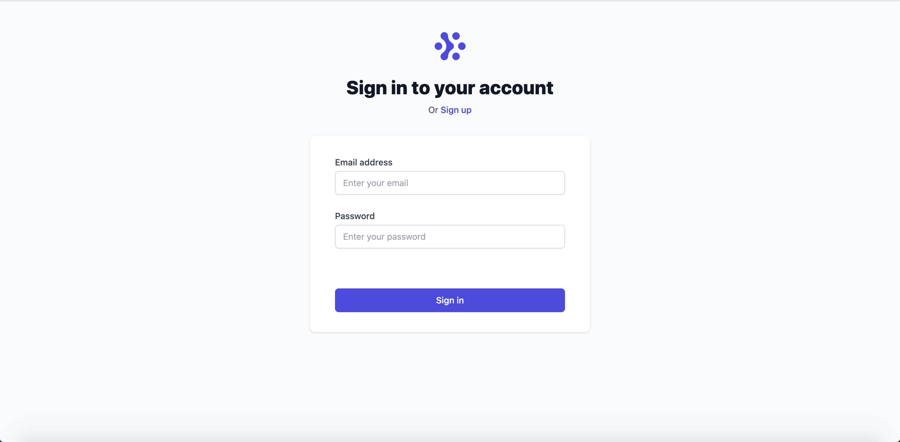
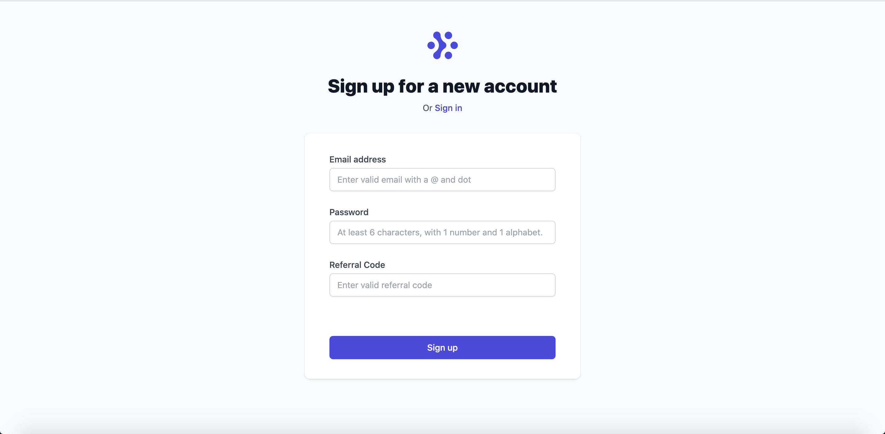
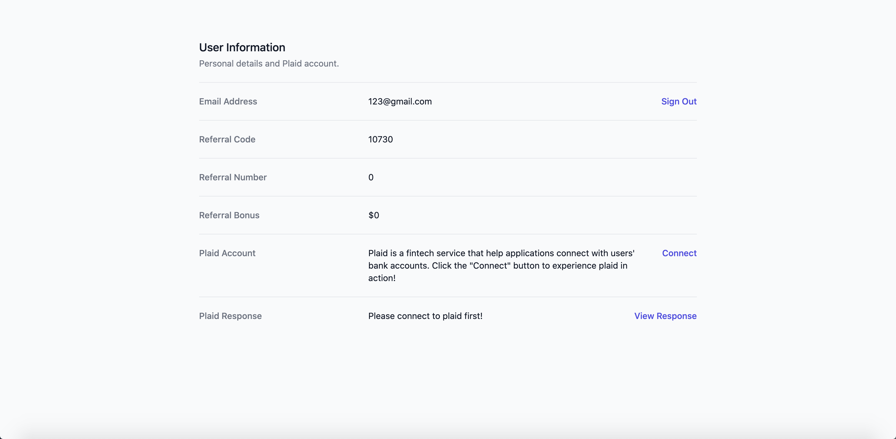
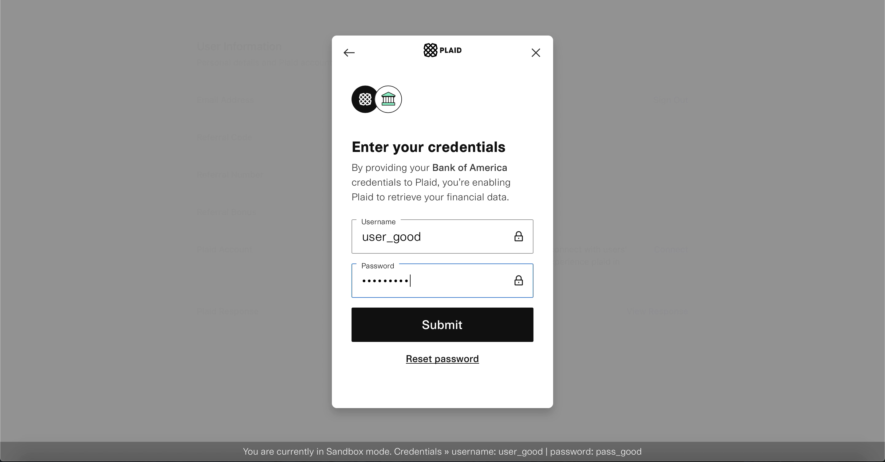

## Introduction

This is a full-stack web dev project built with Next.js, GraphQL, JavaScript & TypeScript, and Prisma as part of my internship training in RoadFlex. The website in this project has 3 pages: signup, signin, and signed-in user information display.

User credentials are stored in a persistent database hosted on [Heroku](https://www.heroku.com/). A referral system is also implemented, where if a new user signs up with the referral code of an existing user, the existing user gets a referral bonus based on his referral count (also stored in database, $5 per referral).

This project also includes an API integration with [Plaid](https://plaid.com/), a financial service provider. The Plaid integration can be found in the signin-ed in page as the "Connect to Plaid" button, which returns the financial information of a mock user as Json from Plaid's sandbox environment.

<br>

## Website Preview

Signin Page:



Signup Page:



User Information Page:



Plaid Integration:



<br>

## Deployment and Demo:

[Vercel Deployment Link](next-js-project-jinxinzhao315.vercel.app)

[Video Demo Link](https://drive.google.com/file/d/173imCnb1hd14dJuYbUsa7j2_7N1seTse/view?usp=sharing)

<br>

## Running the project locally

To run the project on your local computer, follow these steps:

1. Clone this repo. Navigate to the `Next.js_Project` folder.

2. To install dependencies, run

   ```
   npm install
   ```

3. Create a file named `.env`, and copy the contents of the `.env.sample` file into `.env`.

4. Input a database URL under the `DATABASE_URL` variable in `.env`. You can create a free PostgreSQL database on Heroku by following this [tutorial](https://dev.to/prisma/how-to-setup-a-free-postgresql-database-on-heroku-1dc1).

5. For the Plaid integration in this project to work, you need to input valid `PLAID_CLIENT_ID` and `PLAID_SECRET` API keys in `.env`. To do so, go to [plaid.com](https://plaid.com/) and click "Get API Keys". You need to sign up for an account and use the "sandbox" mode credentials. If you do not intend to use Plaid, skip this step.

6. Sync your remote database schema with your local Prisma schema by running

   ```
   npx prisma db push
   ```

   You can add some dummy data in the database by running

   ```
   npx prisma studio
   ```

   to see and manully change records in the database.

7. To launch the website, run

   ```
   npm run dev
   ```

8. Open [http://localhost:3000](http://localhost:3000) with your browser to see the result.

9. For the Plaid integration to work, navigate to the `Next.js_Project/node` folder. Run

   ```
   node index.js
   ```

   to run the Plaid backend server at http://localhost:8000. If you do not intent to use Plaid, skip this step.

<br>

## Ackowledgement

This project is based on the following Next.js tutorial: [How to Build a Fullstack App with Next.js, Prisma, and PostgreSQL](https://vercel.com/guides/nextjs-prisma-postgres)
